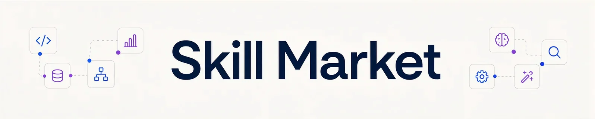

# Skill Market

Portable skills for Claude Code, Codex, Cursor, and other Agent Skills-compatible tools.

Browse individual skills or install a curated collection. Every skill uses [`SKILL.md`](https://agentskills.io/specification) as its canonical format, with optional harness-specific metadata kept in separate adapters.

## Available skills

### `ohada-legal-practice`

Research and drafting workflows for OHADA business law and the national law of 15 francophone member states.

```bash
npx skills add mrstev3n/Skill-Market --skill ohada-legal-practice
```

### `website-legal-compliance`

Audit and drafting workflows for legal notices, privacy, cookies, and e-commerce across multiple jurisdictions.

```bash
npx skills add mrstev3n/Skill-Market --skill website-legal-compliance
```

## Install the Legal collection

The `legal` collection installs both skills:

```bash
npx skills add mrstev3n/Skill-Market \
  --skill ohada-legal-practice \
  --skill website-legal-compliance
```

List all available skills before installing:

```bash
npx skills add mrstev3n/Skill-Market --list
```

## Catalogue

Skill Market supports three discovery layers:

- **Categories** group skills by primary field.
- **Tags** connect skills across fields and use cases.
- **Collections** bundle several skills into one installable set.

Legal is the first collection in a marketplace designed to grow across multiple fields.

Machine-readable metadata lives in [`catalog/marketplace.json`](catalog/marketplace.json). See the [metadata model](docs/metadata.md) and [compatibility policy](docs/compatibility.md) for details.

## Validate

```bash
npm run validate
```

The validation workflow checks catalogue schemas, skill structure, links, adapters, and collection integrity.

## Licence

Apache License 2.0. See [`LICENSE`](LICENSE).
